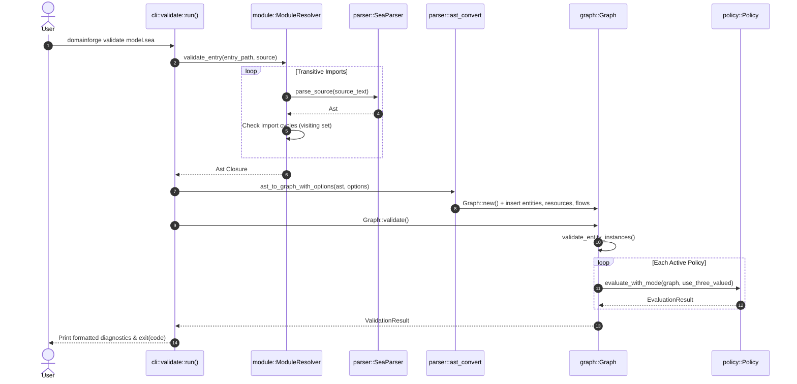

# Execution Trace: Model Parsing & Validation

This document traces the complete execution lifecycle of parsing a SEA DSL model and performing semantic validation through the CLI command `domainforge validate model.sea` or the API call `parse_to_graph(source)`.

---

## 1. Summary

When a user validates a SEA file, DomainForge resolves its transitive import closure across multiple files, parses each source file with a PEG grammar into an Abstract Syntax Tree (AST), lowers the AST into a relational `Graph` using deterministic `IndexMap` collections, validates all entity instance field values against their schemas, and evaluates all declared policies using three-valued logic.

---

## 2. Sequence Diagram

---

## 3. Step-by-Step Execution Trace

### Step 1: CLI Entry & Argument Parsing
- **File**: `domainforge-core/src/bin/domainforge.rs:14`
- **Action**: `Cli::parse()` matches subcommand `Commands::Validate(args)`. Control dispatches to `domainforge_core::cli::validate::run(args)`.
- **Arguments**: Reads `path`, optional `--registry`, `--format` (`human` or `json`), and `--allow-unknown`.

### Step 2: Transitive Module Resolution
- **File**: `domainforge-core/src/module/resolver.rs:50`
- **Function**: `ModuleResolver::validate_entry()`
- **Action**: Resolves relative imports (`import { X } from "./other.sea"`). The resolver maintains a `visiting: HashSet<PathBuf>` to detect circular dependency cycles. If a cycle is detected, resolution halts with `APP014_IMPORT_CYCLE`.

### Step 3: Lexical & Syntactic Parsing (Pest PEG)
- **File**: `domainforge-core/src/parser/mod.rs:48` and `grammar/sea.pest`
- **Function**: `SeaParser::parse(Rule::program, source)`
- **Action**: Pest walks the input text matching rules for comments, file headers, entity declarations, flows, and policy expressions.
- **Failure Branch**: If a token mismatch occurs, Pest returns a `ParseError::PestError` with exact line and column numbers.

### Step 4: AST Construction & Semantic Lowering
- **File**: `domainforge-core/src/parser/ast_convert.rs:25`
- **Function**: `ast_to_graph_with_options(ast, options)`
- **Action**: Iterates over `ast.declarations`. For each node:
  - Computes deterministic `ConceptId` from namespace and name.
  - Inserts the primitive into the corresponding `IndexMap` in `Graph`.
  - Rejects duplicate declarations with `E007_DuplicateDeclaration`.

### Step 5: Entity Instance Validation
- **File**: `domainforge-core/src/graph/entity_validation.rs:18`
- **Function**: `Graph::validate_entity_instances()`
- **Action**: For each `Instance` in `graph.entity_instances`, verifies that:
  - The referenced entity exists.
  - All mandatory (non-optional) fields are present.
  - Field values match declared types (`int`, `string`, `uuid`, `quantity`, `enum`).
  - Scalar constraints (`min_length`, `max`, `pattern`) are satisfied.

### Step 6: Three-Valued Policy Evaluation
- **File**: `domainforge-core/src/graph/mod.rs:933`
- **Function**: `Graph::validate()`
- **Action**: Iterates over `graph.policies`:
  - Skips policies bound to specific operations (which are checked in operation context).
  - Calls `policy.evaluate_with_mode(self, use_three_valued_logic)`.
  - Folds collection quantifiers (`forall`, `exists`).
  - If evaluation yields `ThreeValuedBool::False`, appends a `Violation` with `Severity::Error`.
  - If evaluation yields `ThreeValuedBool::Null`, marks as `Unknown` (suppressed if `--allow-unknown` is set).

### Step 7: Output Emission & Exit
- **File**: `domainforge-core/src/cli/validate.rs:85`
- **Action**: Formats `ValidationResult`. If `--format json` was supplied, emits machine-readable JSON diagnostics. If errors exist, terminates with exit code 1; otherwise terminates with exit code 0.

---

## Source Trail
- `domainforge-core/src/cli/validate.rs` — CLI validate runner
- `domainforge-core/src/module/resolver.rs` — `ModuleResolver` and import cycle checks
- `domainforge-core/src/parser/ast_convert.rs` — `ast_to_graph_with_options()`
- `domainforge-core/src/graph/entity_validation.rs` — `Graph::validate_entity_instances()`
- `domainforge-core/src/graph/mod.rs` — `Graph::validate()`
- `domainforge-core/src/policy/core.rs` — `Policy::evaluate_with_mode()`
