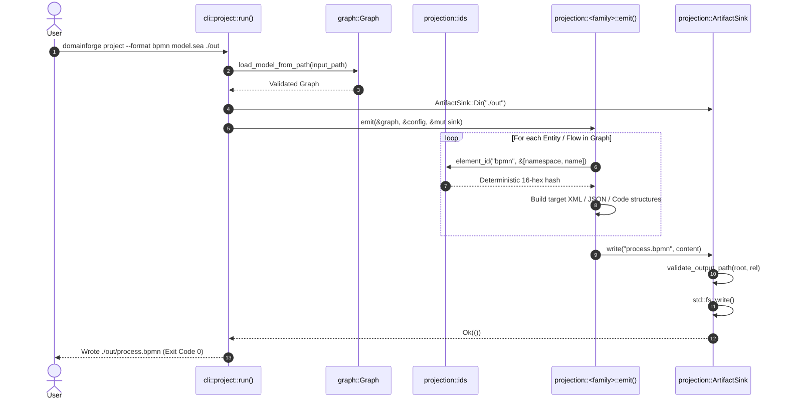

# Execution Trace: Multi-Target Projection Generation

This document traces how a validated SEA model is lowered into external format artifacts across 17+ targets via the CLI command `domainforge project --format <target> input.sea ./output`.

---

## 1. Summary

The projection workflow loads and validates a SEA DSL model into an in-memory `Graph`, initializes a path-safe `ArtifactSink`, mints deterministic element IDs using content hashing (xxh64 seed 42), constructs a target-specific Intermediate Representation (IR), and executes a pure renderer that writes output files (code, XML, YAML, JSON, or formal specs) deterministically.

---

## 2. Sequence Diagram

---

## 3. Step-by-Step Execution Trace

### Step 1: Subcommand Ingestion
- **File**: `domainforge-core/src/cli/project.rs:45`
- **Function**: `project::run(args)`
- **Action**: Matches the target format from `--format` (e.g. `ProjectFormat::Bpmn`, `ProjectFormat::DomainPython`, `ProjectFormat::Rdf`).

### Step 2: Model Ingestion & Validation
- **File**: `domainforge-core/src/cli/project.rs:112`
- **Action**: Parses the input file and resolves the transitive module closure. Validates the graph:
  - If validation fails, projection halts immediately with error diagnostics, preventing malformed or invalid models from being projected.

### Step 3: Sink Initialization & Path Containment
- **File**: `domainforge-core/src/projection/sink.rs:12`
- **Action**: Initializes `ArtifactSink::Dir(output_path)`. When tests run in memory, `ArtifactSink::Memory` is used instead, capturing output files in a `BTreeMap<String, String>` without touching the filesystem.

### Step 4: Deterministic ID Minting
- **File**: `domainforge-core/src/projection/ids.rs:25`
- **Function**: `ids::element_id(family, parts)`
- **Action**: For every node generated in the target format:
  - Joins the family name and parts with `U+0001` (`\u{1}`).
  - Computes an xxh64 hash with fixed seed 42.
  - Returns a 16-character hexadecimal identifier.
- **Invariant**: The same concept always receives the exact same ID within a family, and cannot collide with IDs generated for a different family.

### Step 5: Rendering & Path Validation
- **File**: `domainforge-core/src/projection/sink.rs:32`
- **Function**: `ArtifactSink::write(rel_path, content)`
- **Action**:
  - Validates `rel_path` using `protobuf::validate_output_path()`. Checks that the canonicalized path starts with the output directory root.
  - **Failure Branch**: If `rel_path` contains `../` attempting to escape the target folder, returns `Err("path traversal detected")` and aborts.
  - Creates parent directories if missing and writes file contents.

### Step 6: Completion
- Returns `Ok(())`. CLI prints success message and output artifact listing.

---

## Source Trail
- `domainforge-core/src/cli/project.rs` — CLI project dispatcher
- `domainforge-core/src/projection/ids.rs` — Deterministic ID hashing and slugification
- `domainforge-core/src/projection/sink.rs` — Path-safe `ArtifactSink`
- `domainforge-core/src/projection/protobuf.rs:validate_output_path` — Path traversal prevention
- `scripts/verify/projection-targets/all.sh` — Verification script checking all targets
